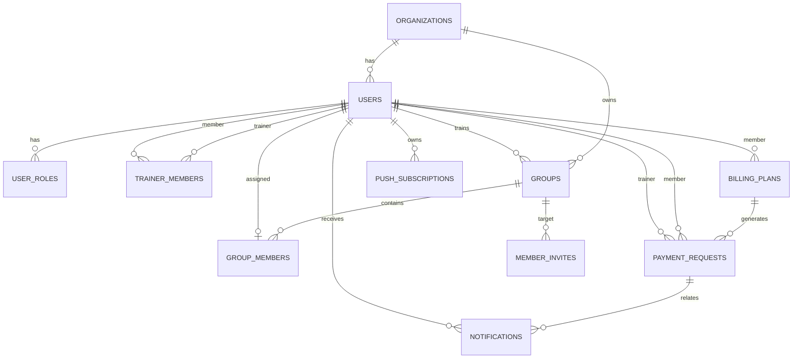

# Database

Production database: Supabase PostgreSQL.

Related docs:

- [architecture.md](./architecture.md)
- [features.md](./features.md)
- [current-state.md](./current-state.md)

## Migrations

Current migration sequence:

1. `001_initial_schema.sql`
2. `002a_payment_statuses.sql`
3. `002_production_core.sql`
4. `003_member_invites.sql`
5. `004_workspace_rpc.sql`
6. `005_payment_prepayments.sql`
7. `006_short_payment_notifications.sql`
8. `007_group_member_invites.sql`
9. `008_static_group_invite_links.sql`
10. `009_realtime_payments_notifications.sql`
11. `010_atomic_payment_confirmation.sql`
12. `011_unique_current_payment.sql`
13. `012_lock_payment_confirmation_rpc.sql`
14. `013_push_subscriptions.sql`

Never edit old applied migrations. Add a new migration.

## Tables

### `organizations`

Club/organization.

- PK: `id`
- Fields: `name`, `created_at`

### `users`

Business profile inside an organization.

- PK: `id`
- FK: `auth_user_id -> auth.users.id`
- FK: `organization_id -> organizations.id`
- Fields: `role`, `username`, `first_name`, `last_name`, `phone`, `email`, `created_at`
- `role` is the primary role; full role set is in `user_roles`.

### `user_roles`

Additional role set per user.

- PK: `(user_id, role)`
- FK: `user_id -> users.id`
- Allows `owner + trainer`.

### `trainer_members`

Trainer responsibility for a member.

- PK: `id`
- FK: `organization_id -> organizations.id`
- FK: `trainer_id -> users.id`
- FK: `member_id -> users.id`
- Unique: `(trainer_id, member_id)`

### `groups`

Training/education group.

- PK: `id`
- FK: `organization_id -> organizations.id`
- FK: `trainer_id -> users.id`
- Fields: `activity`, `days`, `time`, `note`, timestamps

### `group_members`

Member assignment to a group.

- PK: `id`
- FK: `organization_id -> organizations.id`
- FK: `group_id -> groups.id`
- FK: `member_id -> users.id`
- Unique: `member_id`
- Current model: one member belongs to one group.

### `billing_plans`

Payment conditions for a member.

- PK: `id`
- FK: organization, member, trainer
- Fields: `type`, `training_format`, `base_amount`, `billing_day`, `active`, timestamps
- `type`: `monthly | one_time`
- `training_format`: `group | individual`

### `payment_requests`

Concrete invoice/current payment.

- PK: `id`
- FK: organization, member, trainer
- FK: `plan_id -> billing_plans.id`
- Fields: `amount`, `due_date`, `status`, `period_label`, `is_current`, `coverage_months`, `paid_at`, delay fields
- Constraint: partial unique index `payment_requests_one_current_per_member_idx` allows only one `is_current = true` payment per member.

Statuses used by the app:

- `active`
- `overdue`
- `delay_requested`
- `delayed`
- `payment_confirmation`
- `paid`

Legacy enum values may still exist in PostgreSQL but should not be created by app code.

### `notifications`

Internal user notifications.

- PK: `id`
- FK: organization, user
- FK: `payment_id -> payment_requests.id`
- Fields: `message`, `event_key`, `read`, `created_at`
- `event_key` deduplicates automatic reminders.

### `member_invites`

Invite link for students.

- PK: `id`
- FK: organization, group, trainer, creator, accepted user
- Fields include `token_hash`, optional `public_token`, `status`, `expires_at`
- Group recruitment links are reusable and long-lived.

### `push_subscriptions`

Browser/PWA web push subscriptions.

- PK: `id`
- FK: organization, user
- Unique: `endpoint`
- Fields: `endpoint`, `p256dh`, `auth`, `user_agent`, timestamps
- Used only by server routes and Web Push delivery.

## Relationships

## Important RPC / Functions

`get_current_identity()`

Returns current app profile and roles for the authenticated Supabase user.

`get_workspace()`

Returns role-filtered workspace JSON for the current user.

`process_payment_reminders()`

Daily reminder/overdue function. Creates reminders:

- three days before due date;
- on due date;
- after overdue.

`confirm_payment_and_advance(p_payment_id, p_organization_id)`

Atomically confirms a payment and creates the next monthly payment if needed.

This prevents the dangerous state where the current invoice is marked paid but the next invoice was not created.

## RLS And Server Checks

RLS is enabled for business tables. The app also repeats checks in server routes because some mutations use the service-role admin client.

Server routes must validate:

- current identity;
- organization boundary;
- role;
- ownership/responsibility;
- target user/group/payment belongs to the same organization.

## Realtime

Realtime is enabled for:

- `payment_requests`
- `notifications`

The client refreshes workspace on relevant events.

## Push Notifications

Push subscriptions are stored in `push_subscriptions`.

Required environment variables:

- `NEXT_PUBLIC_VAPID_PUBLIC_KEY`
- `VAPID_PRIVATE_KEY`
- `VAPID_SUBJECT`

Push delivery is event-based: when the app creates an internal notification, the server also attempts to send web push to the same user.

Scheduled reminder push is not a separate cron flow yet; reminders still originate from the existing database reminder function and internal notifications.

## Auth Structure

- Supabase Auth stores credentials.
- App profile is in `public.users`.
- Login is converted to an internal email under `auth.tartib.local`.
- Real verified email is postponed.

## Storage

Storage buckets are not used in the MVP.
